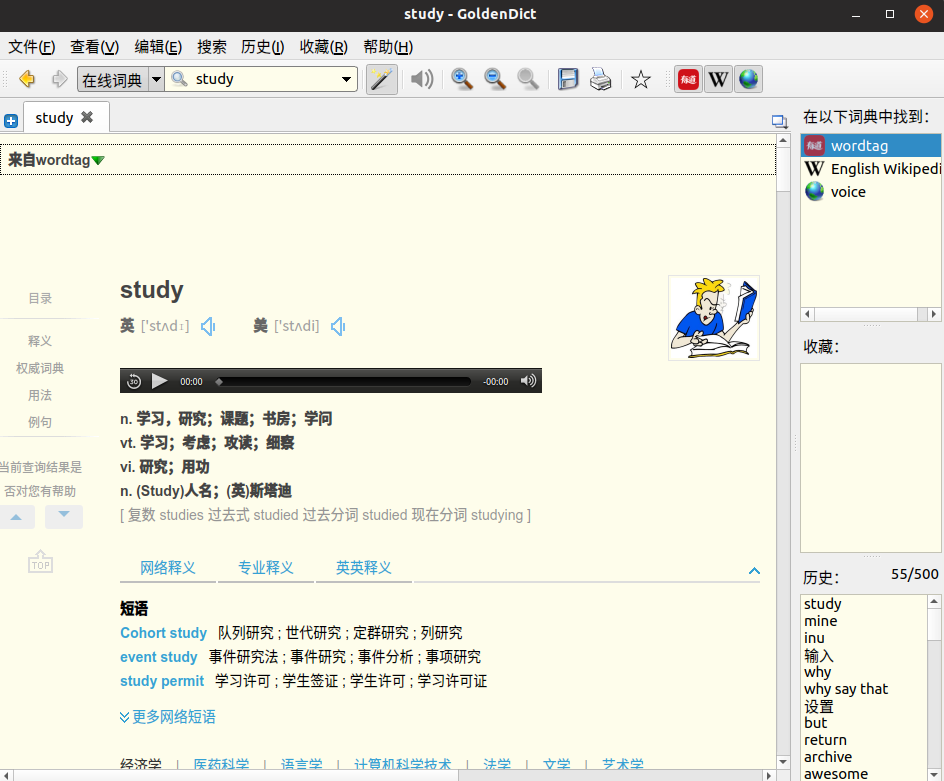
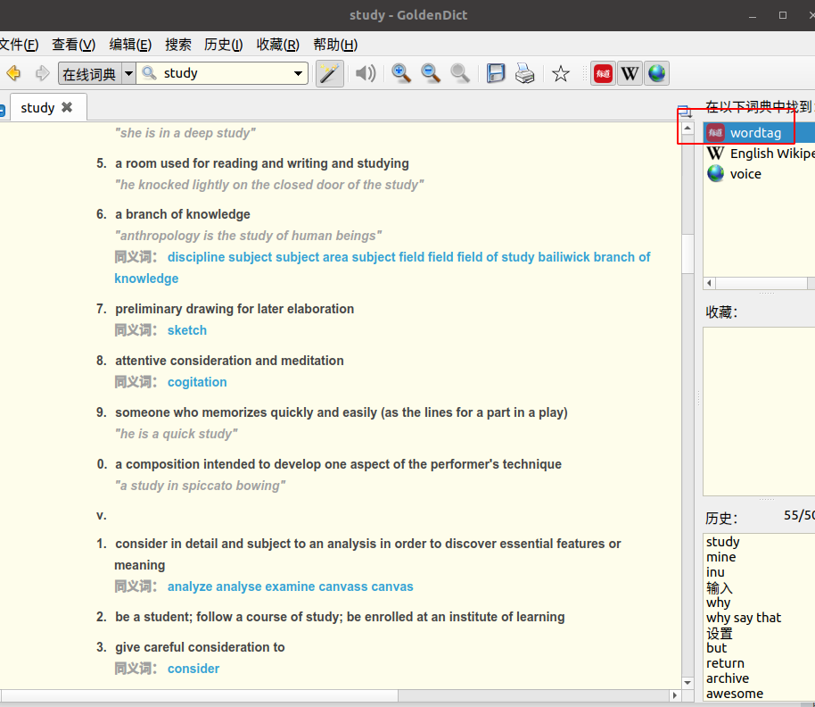

# yd_dict

有道词典在线翻译，GoldenDict小程序，直接在goldenDict中实现有道词典在线翻译，在线查词的功能

<!-- TOC -->

- [yd_dict](#yd_dict)
    - [使用goldendict添加小程序](#使用goldendict添加小程序)
    - [功能效果](#功能效果)
    - [运行环境](#运行环境)
    - [如何使用](#如何使用)
    - [修改内容（2019年3月8日）](#修改内容2019年3月8日)

<!-- /TOC -->


## 使用goldendict添加小程序

* 添加python脚本，实现goldendict在线查词的功能，本脚本参考:[gd_plugin](https://github.com/easeflyer/gd_plugin)

## 功能效果





## 运行环境

需要在python3中使用，所以linux中必须要有python3哦

```python
#!/usr/bin/env python3
# -*- coding: utf-8 -*-

import requests
from lxml import etree
from sys import argv
```
所以如果出错先在python3环境下安装下面模块吧

```python
$ pip install requests #或者  pipenv install requests
$ pip install lxml 
```


## 如何使用

| 已启用|类型 |名称 | 命令行| 图标|
|---|---|---|---|---|
| [v]|html|词典名称随意填|/词典路径/wordtag.py %GDWORD%|/图标路径/png.png|


## 修改内容（2019年3月8日）

- 添加了有到网页效果的css样式，使查词词汇显示格式更丰富

- 添加了查词的在线单词发音获取功能
