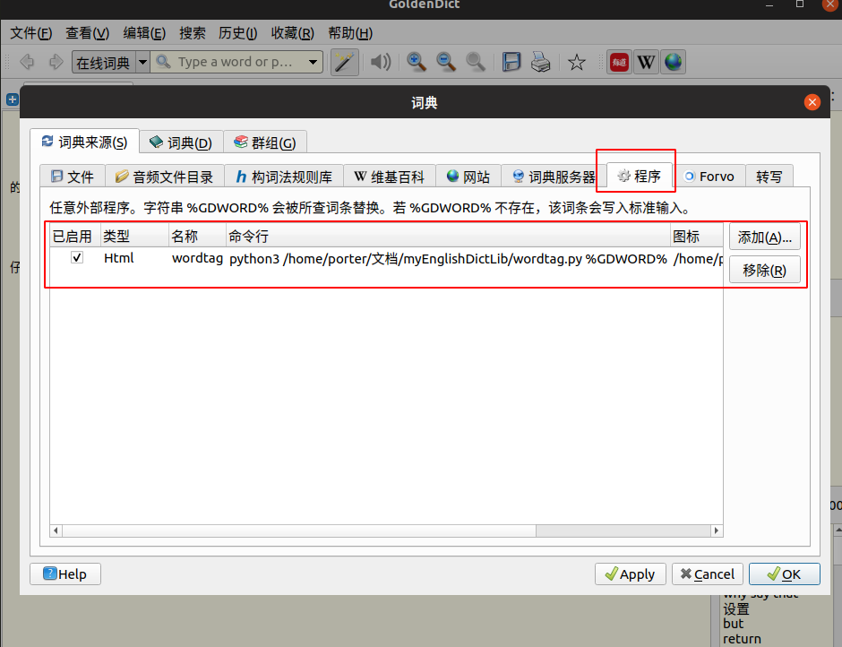

# yd_dict

有道词典在线翻译，GoldenDict小程序，直接在goldenDict中实现有道词典在线翻译，在线查词的功能

<!-- TOC -->

- [yd_dict](#yd_dict)
- [方法一 使用goldendict添加小程序](#方法一-使用goldendict添加小程序)
    - [功能效果](#功能效果)
    - [运行环境](#运行环境)
    - [如何使用](#如何使用)
    - [修改内容（2019年3月8日）](#修改内容2019年3月8日)
- [方法二 使用本地网页实现有道查词功能](#方法二-使用本地网页实现有道查词功能)

<!-- /TOC -->


# 方法一 使用goldendict添加小程序

* 添加python脚本，实现goldendict在线查词的功能，本脚本参考:[gd_plugin](https://github.com/easeflyer/gd_plugin)

## 功能效果


## 运行环境

需要在python3中使用，所以linux中必须要有python3哦

```python
#!/usr/bin/env python3
# -*- coding: utf-8 -*-

import requests
from lxml import etree
from sys import argv
```
所以如果出错先在python3环境下安装下面模块吧

```python
$ pip install requests #或者  pipenv install requests
$ pip install lxml 
```


## 如何使用

| 已启用|类型 |名称 | 命令行| 图标|
|---|---|---|---|---|
| [v]|html|词典名称随意填|/词典路径/wordtag.py %GDWORD%|/图标路径/png.png|




## 修改内容（2019年3月8日）

- 添加了有到网页效果的css样式，使查词词汇显示格式更丰富

- 添加了查词的在线单词发音获取功能

具体的使用文件对象为：[python3环境下代码文件](./yd_dict_py3.py)

具体的使用文件对象为：[python2环境下代码文件](./yd_dict_py2.py)

# 方法二 使用本地网页实现有道查词功能


具体的设置方法如下图


具体的html代码如下:

```html
<!DOCTYPE html>
<html>
<head>
    <meta charset=utf-8 />
    <meta name="viewport" content="width=device-width, initial-scale=1.0, minimum-scale=0.5, maximum-scale=2.0, user-scalable=yes" />
    <style>
        iframe{  width: 100%; height: 960px; margin-top:-250px; margin-left:0px;
        }
    </style>
    <!--使用方法：file:///home/zhangyang/Project/dict.html?a=%GDWORD%-->
    <!--来源：https://github.com/houoop/nodejs-blog/blob/master/posts/4-%E5%A6%99%E7%94%A8GoldenDict%E4%BD%BF%E7%94%A8%E6%9C%89%E9%81%93%E8%AF%8D%E5%85%B8%E5%92%8C%E6%9C%89%E9%81%93%E5%8D%95%E8%AF%8D%E6%9C%AC-(2013-4-12).md-->
</head>

<body>
    <iframe id="a" frameborder="0" >
    </iframe>
    <script>
    var word = location.href.slice(location.href.indexOf('?a')+3);
    document.getElementById('a').setAttribute(
        'src',
        'http://dict.youdao.com/search?le=eng&q=' + word + '&keyfrom=dict.top');
    </script>
</body>
</html>
```

具体的使用文件对象为：[html代码文件](./youdao.html)
